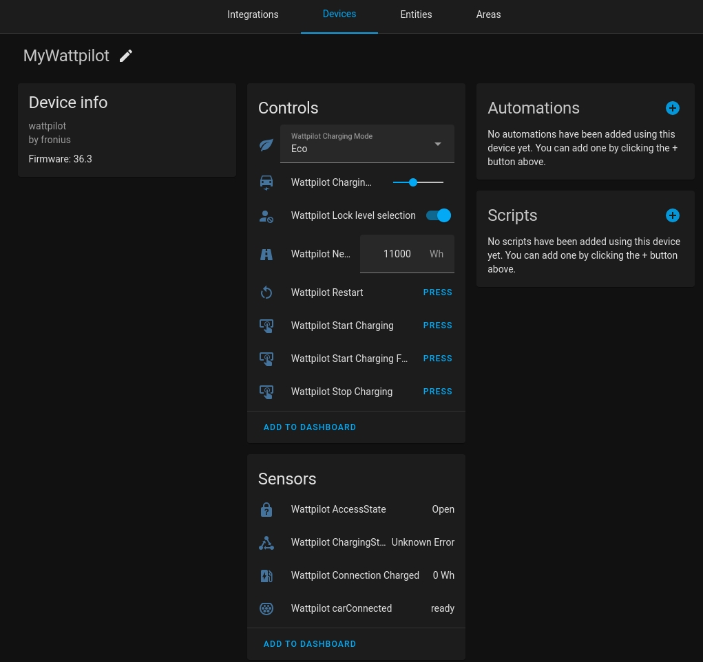
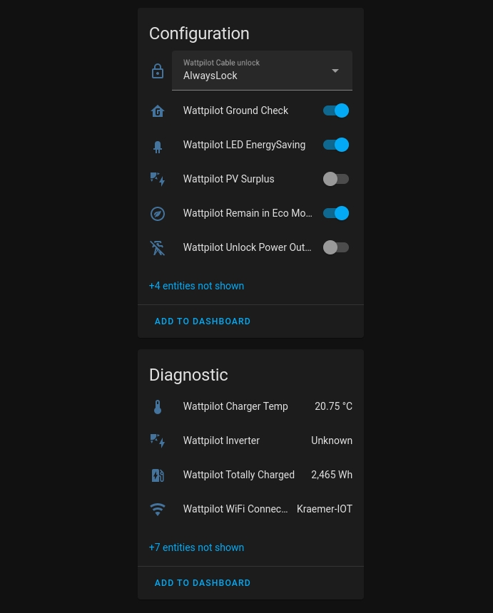
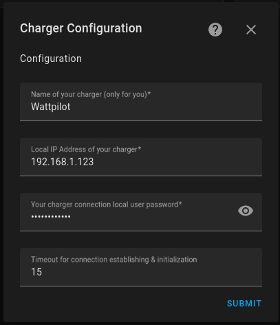

[Wattpilot Custom Component](https://github.com/mk-maddin/wattpilot-HA) for homeassistant

# What This Is:

This is a custom component to allow control of [Fronius Wattpilot](https://www.fronius.com/en/solar-energy/installers-partners/technical-data/all-products/solutions/fronius-wattpilot/fronius-wattpilot/wattpilot-home-11-j) wallbox/electro vehicle charging devices in [Homeassistant](https://home-assistant.io) using the unofficial/reverese enginered [wattpilot python module](https://github.com/joscha82/wattpilot).

WARNING: 
This is a work in progress project - it is still in early development stage, so there are still breaking changes possible.

## Disclaimer:
As written this is an unofficial implementation.
Currently there does not seem to be an official API available by fronius, so this is all based on the work of volunteers and hobby programmers.
It might stop working at any point in time.

You are using this module (and it's prerequisites/dependencies) at your own risk.
Not me neither any of contributors to this or any prerequired/dependency project are responsible for damage in any kind caused by this project or any of its prerequsites/dependencies.

# What It Does:

Allows for control of [Fronius Wattpilot](https://www.fronius.com/en/solar-energy/installers-partners/technical-data/all-products/solutions/fronius-wattpilot/fronius-wattpilot/wattpilot-home-11-j) wallbox/electro vehicle charging devices via home assistant with the following features:

- charging mode change
- start / stop charging
- configuration for different charging behaviours
- sensors for charging box status
- next trip timing configuration via service call (& event when next trip timing value is changed)
	-> you can create an [input_datetime (example)](packages/wattpilot/wattpilot_input_datetime.yaml) entity & corresponding [automation (example)](packages/wattpilot/wattpilot_automation.yaml) which ensures the input_datetime is in sync with the setting wihtin your wattpilot charger
- log value changes for properties of the wallbox as warnings (enable/disable via service call)
- can enable/disable e-go cloud charging API (enable/disable via service call)
	-> this is at your own responsibility - is not clear if fronius/you "pay" in some way for the e-go cloud API and thus are legally allowed to use
	-> as it is not required at the moment for the functionality of this component, I do not recommend to enable

## Open Topics:

- create an [update entity](https://www.home-assistant.io/blog/2022/04/06/release-20224/#introducing-update-entities)
- create a light integration for LED color control etc.
- OCPP values support
- switch to enable/disable AP Mode/Hotspot of device
	-> Did somebody find a corresponding functionality wihtin the Wattpilot APP?

## Known Errors:

- the "Lock level selection" type has changed with firmware version 38.5 to SELECT where previously it was a SWITCH.
  By default this repository is configured for firmware >= 38.5.
  If you are running older version, please uncomment the area wihtin [switch.yaml](https://github.com/mk-maddin/wattpilot-HA/blob/0d8815a71546bba6ee0f8b7a08453ec346ebb69f/custom_components/wattpilot/switch.yaml#L25) and comment the area wihtin [select.yaml](https://github.com/mk-maddin/wattpilot-HA/blob/0d8815a71546bba6ee0f8b7a08453ec346ebb69f/custom_components/wattpilot/select.yaml#L36).
- config_flow Options workflow (if you press "configure" button within Integrations view) does not work.
  WORKAROUND: If you want to change options remove and re-add the entity.

# Screenshots

### Example Device (additional sensors + buttons can be enabled)

### Next Trip via timing via Service Call

# Installation and Configuration

ATTENTION: Default configuration is for wattpilot firmware version > 38.5 !!
	If you are using older firmware, please read "Known Errors" instructions.

## Installation
Download the repository and save the "wattpilot" folder into your home assistant custom_components directory.

Once the files are downloaded, you’ll need to **restart HomeAssistant** and wait some minutes (probably clear your browser cache),
for the integration to appear within the integration store.

## Configuration

### Optional: 
[MyHA - Add Integration](https://my.home-assistant.io/redirect/config_flow_start?domain=wattpilot)

### Manually:
1. Browse to your Home Assistant instance.
2. In the sidebar click on  Configuration.
3. From the configuration menu select:  Integrations.
4. In the bottom right, click on the  Add Integration button.
5. From the list, search and select "Fronius Wattpilot".
6. Follow the instruction on screen to complete the set up.

# Credits:
Big thank you go to [@joscha82](https://github.com/joscha82).
Without his greate prework in the [wattpilot python module](https://github.com/joscha82/wattpilot) it would be not possible to create this. 

# License

[Apache-2.0](LICENSE). By providing a contribution, you agree the contribution is licensed under Apache-2.0. This is required for Home Assistant contributions.
